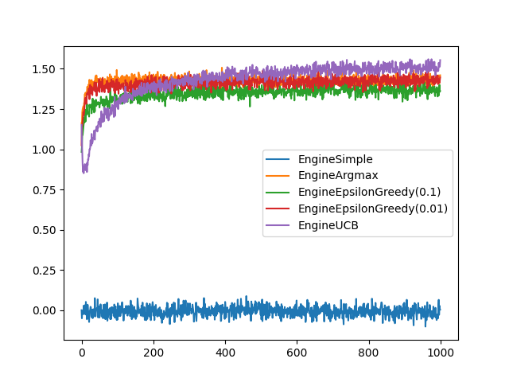

# n-arm-bandit

N-arm bandit simulator as per chapter two in [*Reinforcement Learning: An Introduction*](http://incompleteideas.net/book/bookdraft2017nov5.pdf).



### Usage:

```python
from engines import EngineUCB

e = EngineUCB(c=2)
e.run()
e.plot()
```

### Contents:

*engines.py* - contains classes with different action selection strategies.

*engine_base.py* - contains most of the logic for the n-arm bandit simulator.

*bandit.py* - A n-arm bandit implementation as described in the text. Extended so that k bandits can be
simulated at the same time.